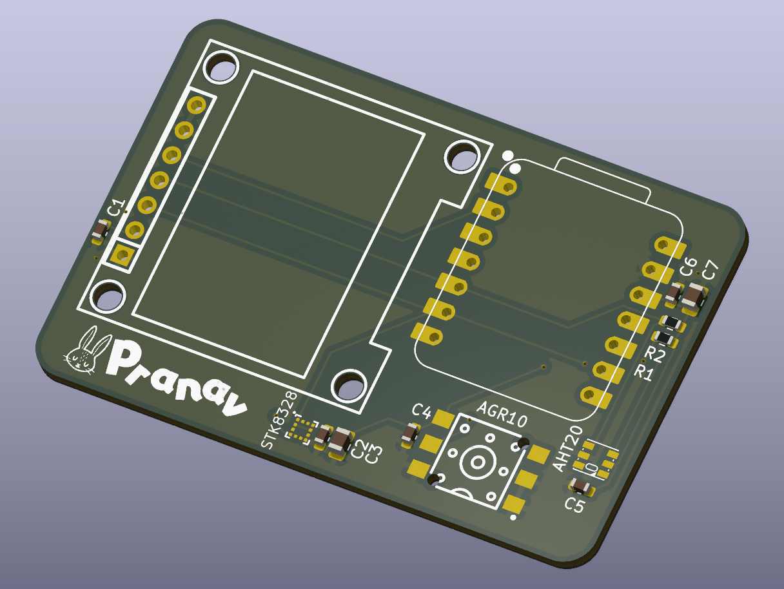
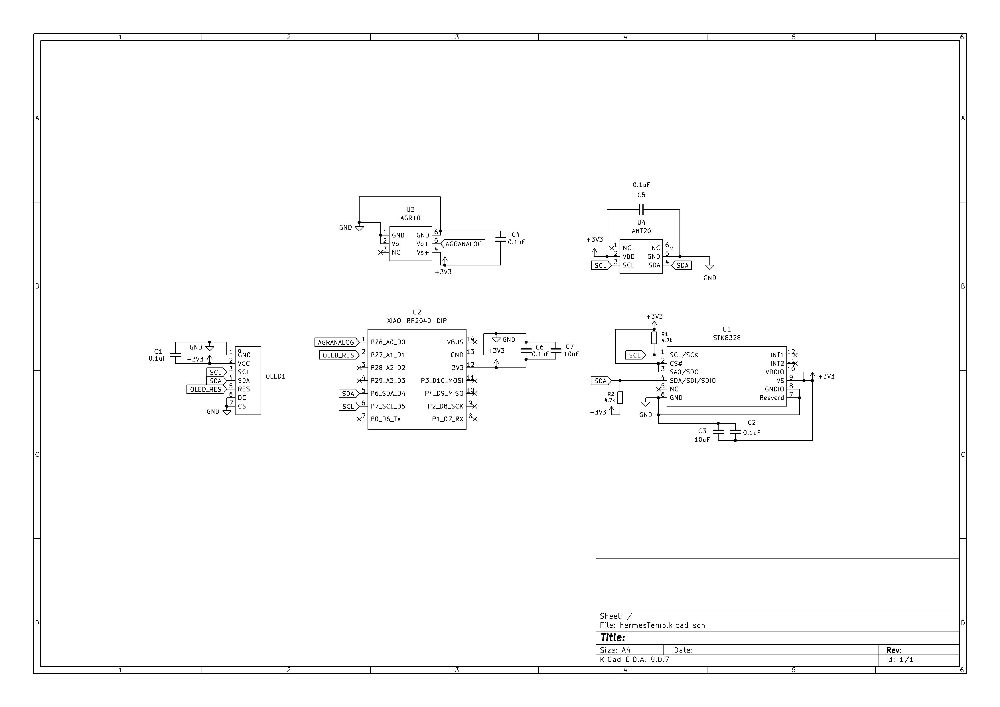
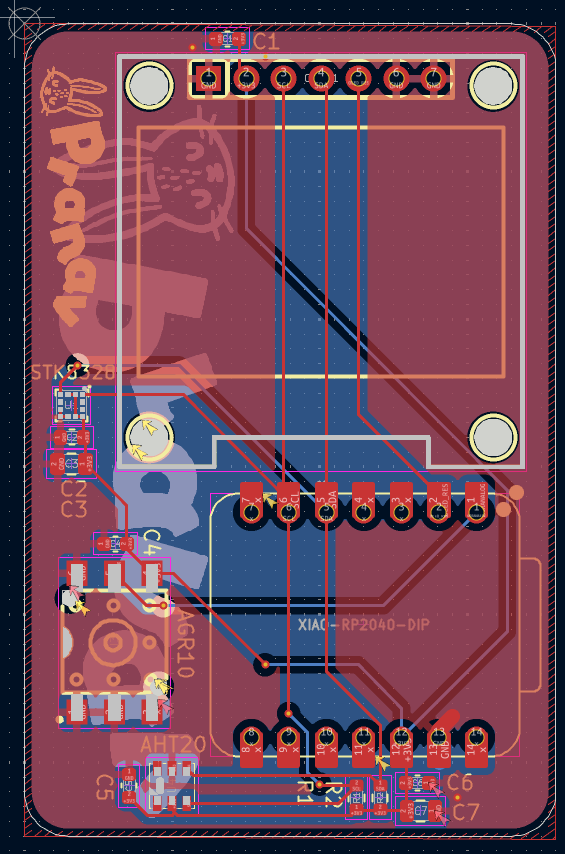
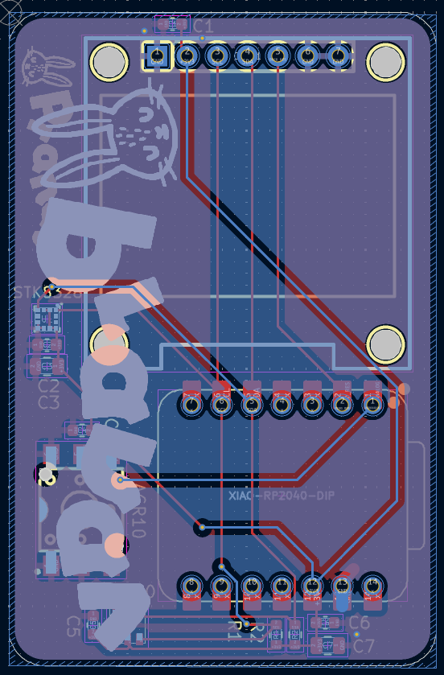

# Bunny's Hermes-TH

Hermes-TH is a small PCB that combines a temperature and humidity sensor, pressure sensor, and accelerometer, specifically the AHT20-F, AGR10, STK8328-C with a tiny OLED display, all controlled by a XIAO RP2040. The idea was to make a simple I2C-based board that reads environmental data that actually matters in my life, namely temperature, humidity, and pressure (unlike carbon monoxide for example), and displays it directly on a screen.

# Schematic
*Made in KiCad*

The XIAO RP2040 module handles everything. D4 and D5 are used for I2C (SCL and SDA), which are shared by the AHT20, OLED, and the accelerometer. The accelerometer is an analog device and read through the ADC pins of the RP2040, specifically A0. All other components are simply controlled through the I2C bus and everything is powered with 3.3V from the RP2040. The OLED is a 128x64 pixel display, which is more than enough for displaying all statistics.

# PCB
*Made in KiCad*

# BOM
* JLC PCBA: USD$37.5 (includes cost of some components)
* OLED: USD$1.9
* XIAO RP2040: USD$6.7
* Robu.in Shipping: USD$0.53
* **Total: USD$46.63**
