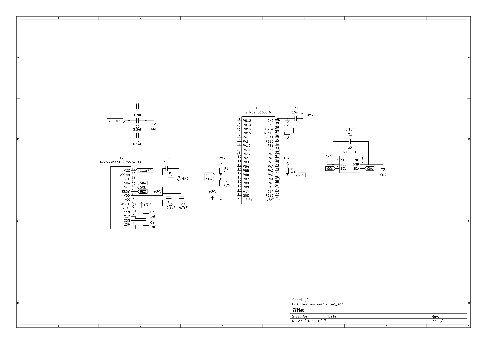

# Bunny's Hermes-TH

Hermes-TH is a small PCB that combines a temperature and humidity sensor, specifically the AHT20-F with a tiny OLED display, N069-9616TSWPG02-H14, controlled by an STM32 microcontroller (LCKFB-DKX-STM32F103C8T6). The idea was to make a simple I2C-based board that reads environmental data that actually matters in my life, namely temperature and humidity (unlike carbon monoxide for example), and displays it directly on a screen.

# Schematic
*Made in KiCad*

The STM32 module handles everything. PB6 and PB7 are used for I2C (SCL and SDA), which are shared by the AHT20 and the OLED. The AHT20 is simple and only needs power, ground, and I2C lines, along with one decoupling capacitor. The OLED is more complicated. It requires charge pump capacitors, since I do not have an external ~7V supply, along with VCOMH capacitor, IREF resistor, and multiple decoupling capacitors

# PCB
*Made in KiCad*

# BOM
## Actual costing for grant/building
* JLC PCBA: USD$39 (includes cost of components)

## KiCad generated
| Reference | Qty | Value | Footprint | Datasheet |
| --- | --- | --- | --- | --- |
| U1 | 1 | N069-9616TSWPG02-H14 | hermesExtraFoot:LCD-SMD_N069-9616TSWPG02-H14 | https://item.szlcsc.com/datasheet/N069-9616TSWPG02-H14/5717754.html |
| U2 | 1 | AHT20 | hermesExtraFoot:SENSOR-SMD-6_AHT20 | https://item.szlcsc.com/datasheet/AHT20-F/3517691.html |
| U3 | 1 | STM32F103C8T6 | hermesExtraFoot:STM32F103C8T6 | https://item.szlcsc.com/datasheet/LCKFB-DKX-STM32F103C8T6/24005615.html |
| C1,C5,C9 | 3 | 0.1uF | Capacitor_SMD:C_0603_1608Metric | ~ |
| C2 | 1 | 2.2uF | Capacitor_SMD:C_0603_1608Metric | ~ |
| C3,C6 | 2 | 4.7uF | Capacitor_SMD:C_0603_1608Metric | ~ |
| C4,C7,C8 | 3 | 1uF | Capacitor_SMD:C_0603_1608Metric | ~ |
| C10 | 1 | 10uF | Capacitor_SMD:C_0603_1608Metric | ~ |
| R1 | 1 | 1M | Resistor_SMD:R_0603_1608Metric | ~ |
| R2,R3 | 2 | 4.7k | Resistor_SMD:R_0603_1608Metric | ~ |
| R4,R5 | 2 | 10k | Resistor_SMD:R_0603_1608Metric | ~ |
